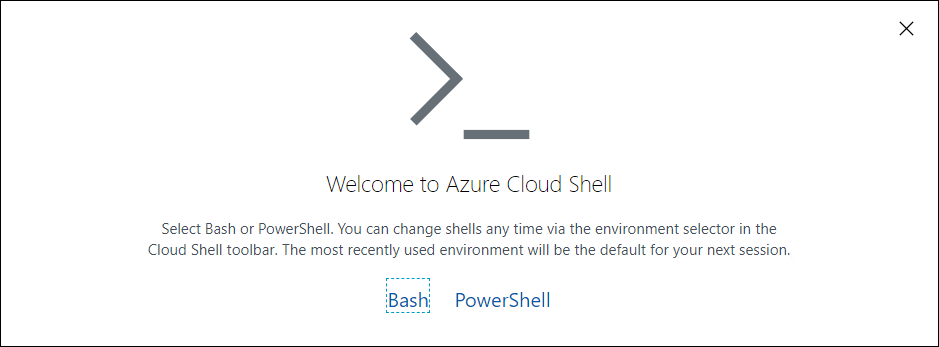
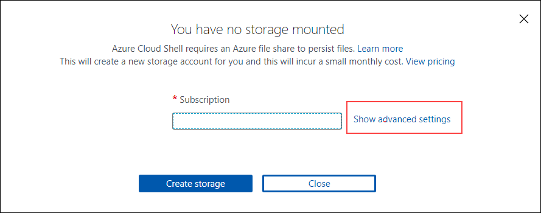
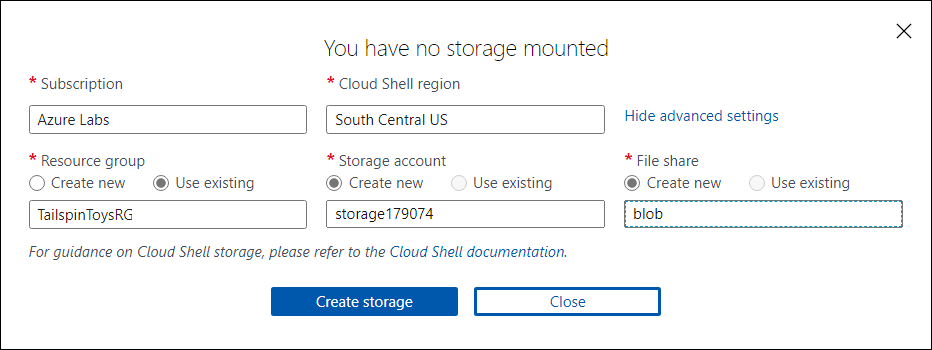

### Getting Started

1. Once the environment is provisioned, a virtual machine (JumpVM) and lab guide will get loaded in your browser.

2. In the JumpVM, click on Azure portal shortcut of Microsoft Edge browser which is created on desktop and login to Azure portal with the username **<inject key="AzureAdUserEmail" />** and Password **<inject key="AzureAdUserPassword" />** and Click on **Sign in**.

    > You can view the Azure Credentials from Environment Details Tab

2. If you see the pop-up  **Stay Signed in?**, click **No**

3. If you see the pop-up **You have free Azure Advisor recommendations!** , close the window to continue the lab. 

4. If a **Welcome to Microsoft Azure** popup window appears, click **Maybe Later** to skip the tour.

## Before the hands-on lab

Duration: 10 minutes

In this lab, you will configure a developer environment and download the required files for this course if you do not already have one that meets the requirements.

### Task 1: Use Azure Shell as your development environment

>**Note**: This workshop can be completed using only the Azure Cloud Shell.

1.  In a web browser, navigate to https:<span></span>//shell.azure.com. Alternatively, from the Azure web portal and login with below credentials.
    * Azure Usename/Email: <inject key="AzureAdUserEmail"></inject>
    * Azure Password: <inject key="AzureAdUserPassword"></inject>

2. Launch the **Azure Cloud Shell**. It has common Azure tools preinstalled and configured to use with your account. 

    
    
3.  After log in to **Azure Cloud Shell** select the **Bash** option from the **Welcome to Azure Cloud shell** dialog box and now you will see a **You have no storage mounted box** and click the option for **Show advanced settings**.

    
    
    

4.  Select **Create new** under **Storage account** and provide values as below:
 
      - **Storage account** : **storageDeployementid**
      - **File Share** : **blob**
      
              
      
  >**Note**: Storage account name should be always unique, Deployement Id can received from **Environment Details** tab     

5.  From inside the Azure Cloud Shell type these commands to configure Git:

    ```bash
    git config --global user.name "<your name>"
    ```

    ```bash
    git config --global user.email <your email>
    ```

>**Note**: Replace the <your name> and <your email> placeholders with your own full name and e-mail address respectively, removing the '<' and '>' characters from the placeholders. This information will be used by the Git CLI for any commits you might do from Azure Cloud Shell.

### Task 2: Download the exercise files

1.  Using the Azure Cloud Shell, you can download the file by executing the following command inside the Cloud Shell window (all on one line):

    ```bash
    curl -o studentfiles.zip https://cloudworkshop.blob.core.windows.net/agile-continous-delivery/studentfiles.zip
    ```

2.  Extract the contents of the file to the new folder. Using the Azure Cloud Shell, you can execute the following command inside the Cloud Shell window:

    ```bash
    unzip studentfiles.zip
    ```

3.  When unzipped, there will be a new folder named **studentfiles**. Navigate to the newly created **studentfiles** directory.

    ```bash
    cd studentfiles
    ```
   
4.  Inside the **studentfiles** folder, there are two folders named **armtemplate** and **tailspintoysweb**. The workshop will refer to these folders throughout the exercises.

>**Note**: Using the Azure Cloud Shell, you
 can load the integrated code editor (Cloud Shell Editor) at any time with the following command:
```bash
code .
```
